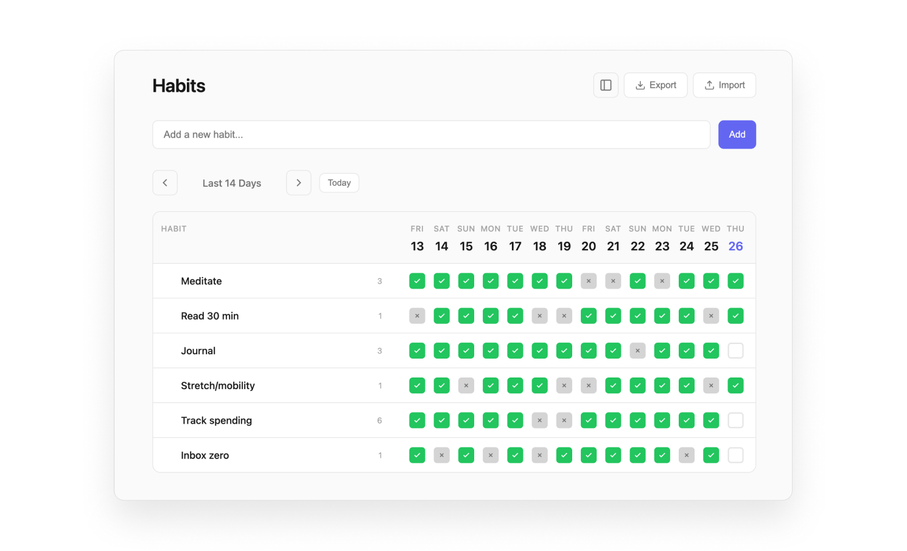

<p align="center">
  
</p>

<h1 align="center">Habits</h1>

<p align="center">A simple daily habit tracker for Chrome.</p>

<p align="center">Chrome · Manifest V3 · Offline</p>
<p align="center"><a href="#install"><strong>Install Habits</strong></a></p>

<!-- <p align="center">
  
</p> -->

## Install

1. Clone or download this repository
2. Open `chrome://extensions` in Chrome
3. Enable **Developer mode** (top-right toggle)
4. Click **Load unpacked** and select the project folder
5. Click the extension icon on any page to open the tracker

## Features

**14-day grid** — See the last two weeks at a glance. Each habit gets a row of checkboxes across 14 days. Navigate forward and back to review older history.

**Three-state tracking** — Click a checkbox to mark it done (green check), click again to mark skipped (grey X), click once more to clear it. Track what you did and what you intentionally skipped.

**Streaks** — Current streak count appears next to each habit. Only consecutive "done" days count — skipped days break the streak.

**New tab mode** — Toggle "New Tab" in the header to replace Chrome's new tab page with your habits. Turn it off to go back to the default new tab. The extension icon always opens the tracker regardless of this setting.

**Drag to reorder** — Grab the dot grid handle on any habit to drag it up or down. Order is saved automatically.

**Inline rename** — Double-click a habit name to edit it in place. Press Enter to save or Escape to cancel.

**Export / Import** — Back up your data as JSON or restore from a previous backup. Useful for moving between machines.

## File Structure

```
habits/
  manifest.json        Extension config (Manifest V3)
  background.js        Service worker (icon click opens tracker)
  newtab-guard.js      Redirects new tabs to default unless opt-in
  habit.html           Main tracker page
  habit.js             App logic (data, rendering, drag-and-drop)
  styles.css           Styles
  privacy-policy.html  Privacy policy
  icons/               Extension icons (16, 32, 48, 128px)
```

## Privacy

This extension does not make any network requests. There is no server, no analytics, and no tracking.

All data is stored locally on your device using `chrome.storage.local`. Nothing leaves your browser. You can export your data as JSON at any time.

The only permission requested is **Storage** — used to save your habits and completion history locally.

## Requirements

- Chrome (or Chromium-based browser)

## License

[MIT](LICENSE)
